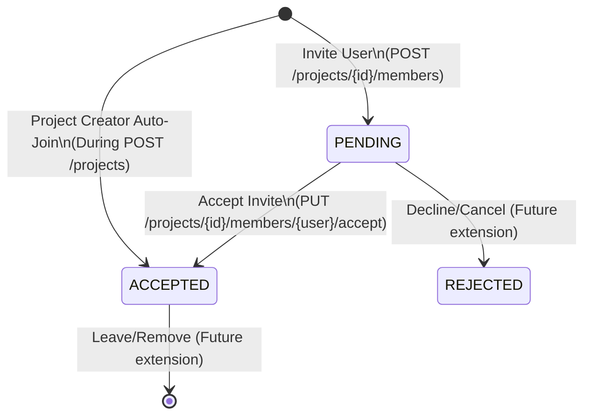

# Product & Design Specification: Project, Member, and User Integration

This document defines the functional requirements, system flow, API specifications, and edge-case handling for the **Project (Workspace)**, **User (Account/Signup)**, and **Project Member (Collaboration/Invitation)** modules.

---

## 1. Domain Separation of Concerns

To allow proper division of labor in the team project:
*   **Project (프로젝트):** Managed under `com.example.demo.projects`. Represents the collaborative workspace (Role 2 & 3). Contains metadata like title, subject, and a unique `inviteCode`.
*   **User (회원):** Managed under `com.example.demo.members`. Represents a registered global account on the platform (Role 1). Users exist independently of any project.
*   **Project Member (프로젝트 참여자):** Managed under `com.example.demo.members`. Represents a user's participation in a specific project. This is a Many-to-Many association with its own lifecycle state machine.

```
 [User Table]                     [Member Mapping Table]                 [Project Table]
+-------------+                  +----------------------+               +-----------------+
| id (PK)     | 1 ------------ * | id (PK)              | * ---------- 1| id (PK)         |
| username    |                  | projectId (FK)       |               | title           |
| name        |                  | userId (FK)          |               | subject         |
| email       |                  | status (PENDING/...) |               | inviteCode (UQ) |
| projectIds  |                  +----------------------+               +-----------------+
+-------------+
```

---

## 2. Project Lifecycle & Membership State Machine

### Project Creation Flow
1.  **Creation:** A project is created with a `title`, `subject`, and an optional `inviteCode`. If no code is provided, a random 6-character code (e.g., `INV-A1B2C3`) is generated.
2.  **Creator Auto-Join:** If a `creatorUsername` is provided during creation, that user is automatically verified and added to the project as an `ACCEPTED` member, eliminating the need for them to invite themselves.

### Membership State Machine


---

## 3. Detailed Logic Sequences

### A. Project Creation Flow (`POST /api/v1/projects`)
```
[User/Tester]           [ProjectController]         [ProjectService]            [MemoryDB]
      |                          |                         |                       |
      |--- POST (Create) ------->|                         |                       |
      | (title, inviteCode,      |--- createProject() ---->|                       |
      |  creatorUsername)        |                         |--- Check InviteCode --|
      |                          |                         |    (Verify unique)    |
      |                          |                         |--- Validate Creator ->|
      |                          |                         |<-- (User exists) -----|
      |                          |                         |--- Save Project ----->|
      |                          |                         |<-- Saved Project -----|
      |                          |                         |--- [If creator] ----->|
      |                          |                         |    Save ACCEPTED      |
      |                          |                         |    Member via Service |
      |                          |<-- Return Response DTO -|                       |
      |<-- 201 Created ----------|                         |                       |
```

### B. Member Invitation & Acceptance Flow
*   **Invite (`POST /api/v1/projects/{projectId}/members`):** Validates project, user, and `inviteCode`. Saves `Member` as `PENDING`.
*   **Accept (`PUT /api/v1/projects/{projectId}/members/{username}/accept`):** Validates `PENDING` status. Updates to `ACCEPTED`. Updates `User.projectIds`.

---

## 4. API Endpoints Specification

### 4.1. Project Endpoints

#### `POST /api/v1/projects`
*   **Description:** Creates a new project workspace and optionally auto-enrolls the creator.
*   **Request Body:**
    ```json
    {
      "title": "클라우드 융합 팀플",
      "subject": "웹개발",
      "description": "최종 프로젝트",
      "inviteCode": "TEAM-1", 
      "creatorUsername": "hong" 
    }
    ```
    *(Note: `inviteCode` and `creatorUsername` are optional)*
*   **Response (201 Created):**
    ```json
    {
      "id": 1,
      "title": "클라우드 융합 팀플",
      "subject": "웹개발",
      "description": "최종 프로젝트",
      "inviteCode": "TEAM-1",
      "members": [
         { "username": "hong", "name": "홍길동", "status": "ACCEPTED" }
      ]
    }
    ```
*   **Error Responses:**
    *   `400 Bad Request` (Missing title/subject).
    *   `400 Bad Request` ("이미 사용 중인 초대 코드입니다.").
    *   `400 Bad Request` ("존재하지 않는 생성자(creatorUsername)입니다.").

#### `GET /api/v1/projects`
*   **Description:** Retrieves list of projects. Can be filtered by participating user.
*   **Query Parameters:**
    *   `username` (optional): If provided, returns only projects where this user is an `ACCEPTED` member.
*   **Response (200 OK):** Array of Project objects.

#### `GET /api/v1/projects/{projectId}`
*   **Description:** Retrieves single project details, including the nested list of its `ACCEPTED` members.

---

### 4.2. User & Member Endpoints

*   **`POST /api/v1/users`:** Signup user (requires `username`, `name`).
*   **`GET /api/v1/users`:** List all users.
*   **`POST /api/v1/projects/{projectId}/members`:** Invite user using `inviteCode` (creates `PENDING` member).
*   **`PUT /api/v1/projects/{projectId}/members/{username}/accept`:** Accept invitation (changes to `ACCEPTED`).
*   **`GET /api/v1/projects/{projectId}/members`:** Returns list of `ACCEPTED` member names (e.g., `["홍길동", "김철수"]`) for dropdowns.
*   **`GET /api/v1/projects/{projectId}/members/details`:** Returns full member objects including status (for admin/tester view).

---

## 5. Edge Case Analysis & Exception Handling

| Module | Edge Case Scenario | Expected Behavior | API Status & Error Message |
| :--- | :--- | :--- | :--- |
| **Project** | **Duplicate Invite Code** | Fails before saving project if a custom code is already in use. | `400 Bad Request` <br> "이미 사용 중인 초대 코드입니다." |
| **Project** | **Invalid Creator Username** | Fails project creation if the provided creator doesn't exist. | `400 Bad Request` <br> "존재하지 않는 생성자 아이디입니다." |
| **Member** | **Inviting User with Wrong Code** | Verification fails before saving relation. | `400 Bad Request` <br> "초대 코드가 일치하지 않습니다." |
| **Member** | **Duplicate Invitation** | Checks existing member relations for the projectId + userId combo. | `400 Bad Request` <br> "이미 프로젝트 가입 요청이 진행 중이거나 멤버로 등록된 상태입니다." |
| **Member** | **Accepting Non-existent Invitation** | Looks for PENDING membership, fails if not found. | `400 Bad Request` <br> "해당 프로젝트의 가입요청(PENDING) 기록을 찾을 수 없습니다." |
| **Task** | **Assigning Task to PENDING Member** | Task service validates assignee has ACCEPTED membership. | `400 Bad Request` <br> "해당 작업자는 프로젝트 가입 승낙이 되지 않았거나 멤버가 아닙니다." |

---

## 6. Verification & Setup Board Test Scenario

Because all repositories start **empty**, the tester will verify the design using a step-by-step sequential integration path via the Frontend API Tester Board:

1.  **Registering Accounts:** 
    *   Sign up `hong` (홍길동) and `kim` (김철수).
2.  **Creating Workspace:** 
    *   Create project `[title: "UI 개편", inviteCode: "UI-100", creatorUsername: "hong"]`. 
    *   *Verification:* `hong` should be automatically `ACCEPTED`.
3.  **Sending Invitations:** 
    *   Invite `kim` using `inviteCode: "UI-100"`. Status becomes `PENDING`.
4.  **Simulating Acceptance:** 
    *   Accept invite for `kim`. Status becomes `ACCEPTED`.
5.  **State Verification:** 
    *   `GET /projects?username=kim` returns the project.
    *   `GET /projects/1/members` returns `["홍길동", "김철수"]`.
6.  **Task Assignment Validation:** 
    *   Create a task assigned to `김철수`. Succeeds.
    *   Try assigning to an unregistered name. Fails.
